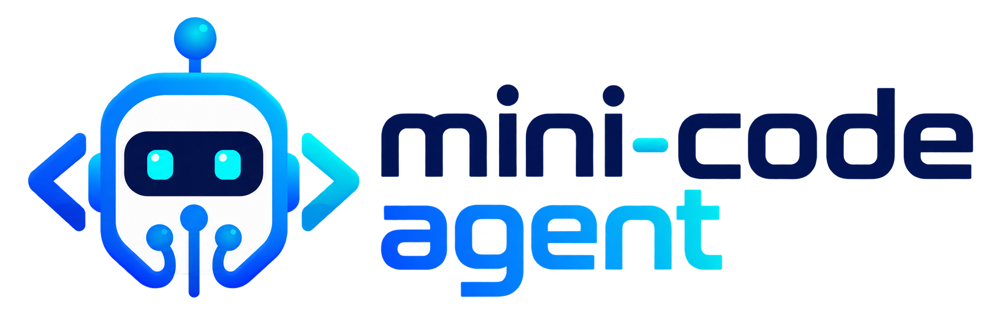
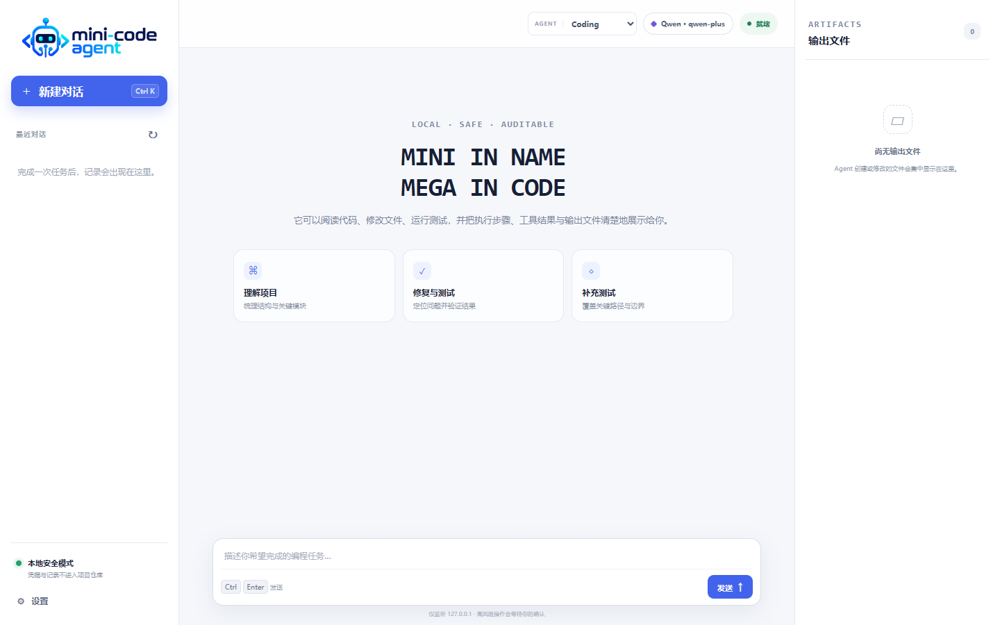
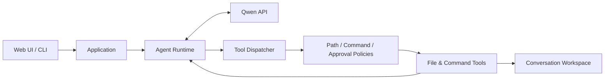

<p align="center">
  
</p>

<p align="center">
  面向 Qwen 的本地编程 Agent：在受限工作区内读取和修改代码、运行命令，并在 Web UI 中呈现可核验的执行结果。
</p>

<p align="center">
  <a href="https://github.com/BlairCode/minicode-agent/actions/workflows/ci.yml"></a>
  <a href="https://www.python.org/"></a>
  <a href="https://www.alibabacloud.com/help/en/model-studio/"></a>
  <a href="LICENSE"></a>
</p>

<p align="center">
  
</p>

## Overview

MiniCode Agent 将模型决策与本地执行分开：Qwen 选择下一步动作，项目自带的 Runtime 校验工具调用、执行文件或命令操作，并把真实结果回填给模型。Agent Loop、上下文管理、工具注册、停止条件、命令审批和工作区隔离均由本项目实现，不依赖第三方 Agent 框架。

默认模型接入使用 DashScope 的 OpenAI-compatible API。代码和运行数据留在本机，但发送给模型的任务内容与上下文会经过所配置的远程 API；本项目不是离线模型运行器。

## Features

- **两种工作模式**：Coding 处理常规代码任务，LeetCode 提供解题、提示、面试和复盘模式。
- **完整工具闭环**：支持文件读取、写入、精确补丁、目录查看、文本搜索和无 Shell 命令执行；工作区内生成的程序可按当前目录直接启动。
- **明确工具契约**：Runtime 在执行前检查参数类型、枚举和数值边界；路径 glob 同时兼容两种分隔符。
- **文件化输入与可见输出**：可上传 UTF-8 文本或源码；模型初始只接收文件名并按需读取。网页展示步骤摘要、工具结果、Markdown 回答和文件预览，也可打开文件所在目录。
- **连续对话**：同一会话可追问并复用上下文；每个会话使用独立工作区。新建空会话会直接创建所需文件，不先扫描空目录。
- **本地数据隔离**：历史与偏好存放在仓库外，API Key 交由操作系统凭据库管理。
- **可恢复停止条件**：提供路径边界、命令风险分级、人工确认、超时、重试、取消和连续工具错误上限；成功动作会清除连续错误计数。

## Quick Start

要求 Python 3.11 或更高版本，以及可用的 DashScope API Key。

```bash
git clone https://github.com/BlairCode/minicode-agent.git
cd minicode-agent
python -m venv .venv
```

激活虚拟环境并安装依赖：

```powershell
# Windows PowerShell
.venv\Scripts\Activate.ps1
python -m pip install -r requirements.txt
```

```bash
# macOS / Linux
source .venv/bin/activate
python -m pip install -r requirements.txt
```

启动网页后，在左下角“设置”中保存 API Key：

```bash
python main.py
```

服务仅监听 `127.0.0.1`，默认使用 `http://127.0.0.1:8765/`。终端模式和其他常用启动方式：

```bash
python main.py --cli
python main.py --no-browser
python main.py --workspace ./workspace --agent coding
python main.py --workspace ./workspace --agent leetcode
```

## Architecture



每次循环中，Runtime 将上下文和可用工具 Schema 发送给模型；Dispatcher 校验模型返回的工具名、参数和 Agent 权限；Safety Layer 决定执行、拒绝或等待确认；工具结果随后以 `tool` 消息进入下一轮上下文。网页只展示可审计的动作和结果，不展示模型隐藏思维链。

## Project Structure

```text
minicode-agent/
├── config/                 # 默认配置与公开用户模板
├── minicode_agent/
│   ├── agent/              # Runtime、上下文、状态与 Agent 规格
│   ├── cli/                # 终端交互
│   ├── llm/                # Qwen 与兼容模型客户端
│   ├── safety/             # 路径、命令和审批策略
│   ├── skills/             # Skill 加载器
│   ├── tools/              # 文件与命令工具
│   └── web/                # 本地 HTTP 服务和前端资源
├── prompts/                # 基础、Coding 与 LeetCode 提示词
├── skills/                 # Python、C++、测试、调试与算法规则
├── tests/                  # 离线自动化测试
├── workspace/              # 会话工作区父目录，运行内容不入库
├── main.py                 # 程序入口
└── pyproject.toml          # 包元数据与 pytest 配置
```

## Configuration

默认配置位于 `config/default.yaml`。如需维护本地覆盖配置，复制公开模板；`config/user.yaml` 已被 Git 忽略。

```powershell
Copy-Item config\user.example.yaml config\user.yaml
python main.py --config config/user.yaml
```

```bash
cp config/user.example.yaml config/user.yaml
python main.py --config config/user.yaml
```

常用配置项：

| 配置 | 默认值 | 说明 |
| --- | --- | --- |
| `model.model` | `qwen-plus` | DashScope 模型名称 |
| `model.base_url` | DashScope compatible-mode | OpenAI-compatible API 地址 |
| `workspace.root` | `./workspace` | 会话工作区父目录 |
| `security.command_mode` | `ask` | 中高风险命令的处理方式 |
| `security.network_access` | `false` | 是否允许工具命令访问网络 |
| `ui.web_port` | `8765` | 本地网页端口 |

模型名、工作区和命令模式可通过 `MINICODE_MODEL`、`MINICODE_WORKSPACE`、`MINICODE_COMMAND_MODE` 临时覆盖。无人值守或脚本化启动还可使用 `MINICODE_REQUEST_TIMEOUT`、`MINICODE_MAX_STEPS`、`MINICODE_CONTEXT_CHAR_BUDGET` 和 `MINICODE_COMMAND_TIMEOUT`。数值非法或越界时程序会在启动阶段直接报错。

也可以只为当前终端提供凭据：

```powershell
$env:DASHSCOPE_API_KEY = "your-api-key"
```

```bash
export DASHSCOPE_API_KEY="your-api-key"
```

不要把真实凭据写入 YAML、`.env.example`、日志或提交记录。

## Safety

- 文件路径会解析为真实绝对路径；工作区外路径、越界 `..` 和指向外部的符号链接默认被拒绝。
- 命令使用 `shell=False` 执行；管道、重定向、命令拼接和命令替换不会交给 Shell 解释。
- Runtime 会把当前操作系统写入模型上下文；工作区内的相对可执行文件在启动前解析为绝对路径，避免 Windows `cwd` 解析差异。
- 命令按 `SAFE`、`MEDIUM`、`HIGH`、`BLOCKED` 分级，中高风险操作可要求人工确认。
- Web 服务只绑定回环地址，API 请求需要当前进程生成的临时会话令牌。
- API Key 使用系统凭据库；历史会话与个人设置默认写入仓库外的用户数据目录。

这些措施用于降低误操作和本地网页被跨站调用的风险，不构成操作系统级沙箱。运行测试或项目命令仍会执行本地代码；处理不可信仓库时应使用容器或虚拟机。

## Testing

测试不需要真实 API Key。CI 与本地检查使用同一组基础命令：

```bash
python -m pip install -r requirements-dev.txt
python -m pip check
python -m compileall -q main.py minicode_agent tests
node --check minicode_agent/web/static/app.js
python -m pytest
```

当前 73 项离线测试覆盖 Agent Loop、首轮工作区提示、可取消重试、连续错误恢复、上下文裁剪、Qwen Tool Calling、上传校验与隔离、工具 Schema 边界、路径 glob、文件夹定位、工作区可执行文件解析、命令策略、审批、超时、损坏历史降级、多轮对话和本地 HTTP 安全头。

## License

本项目使用 [MIT License](LICENSE)。
